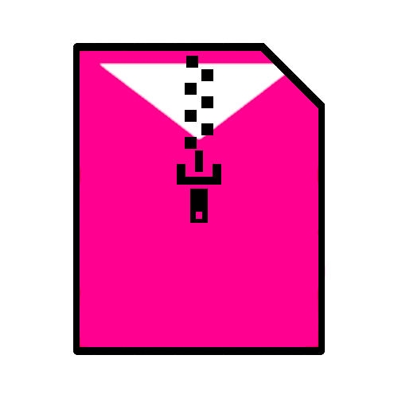

<p align="center">

</p>

# BeatSaverExtractor

A simple tool to autoextract levels downloaded from [beatsaver](https://beatsaver.com/).

## How to use

* Copy/move the zip(s) downloaded from the site
* Either double click on `start.bat` or launch it from the command line:

```bash
py BeatSaverExtractor.py 
```
* open beat saber and enjoy